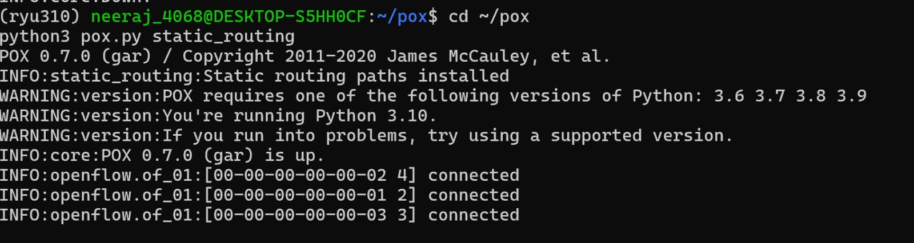
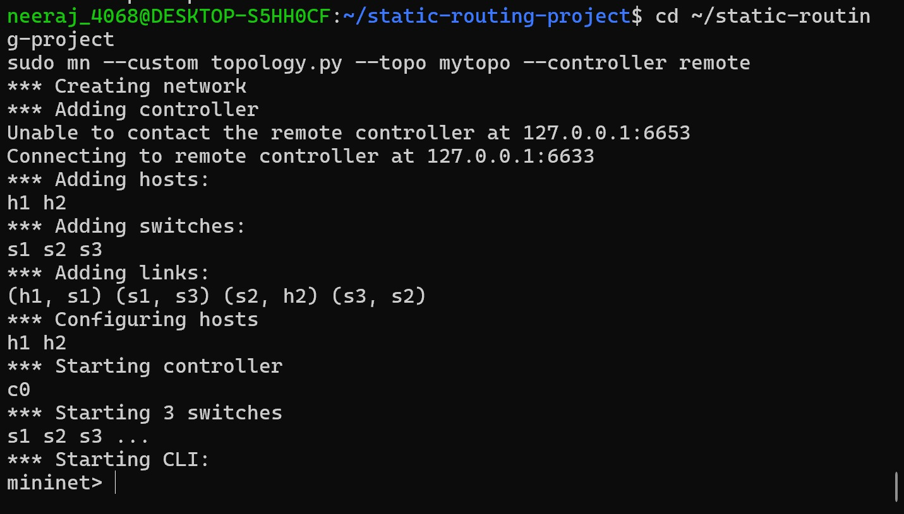
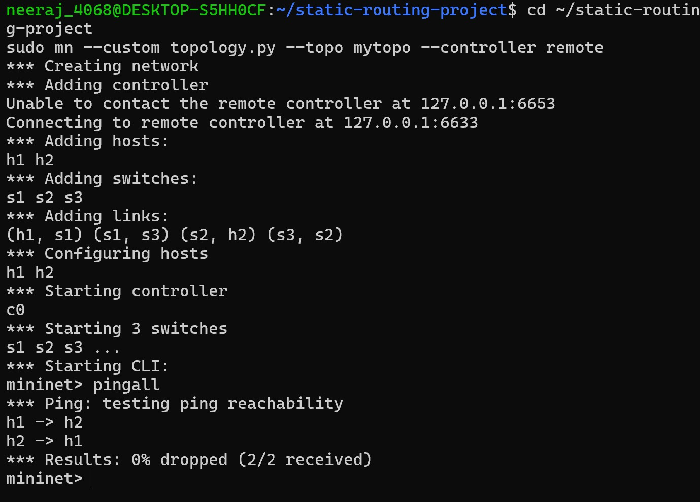
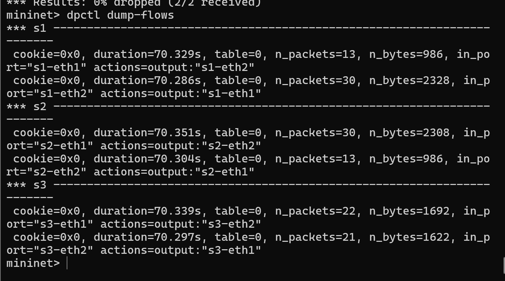
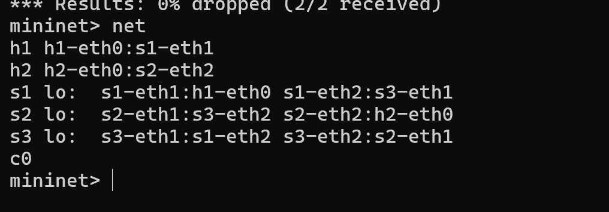

# Static Routing using SDN (POX + Mininet)

##  Problem Statement

This project implements **static routing in Software Defined Networking (SDN)** using the POX controller and Mininet. The objective is to manually define routing paths and install flow rules to ensure controlled packet forwarding between hosts.

---

##  Tools & Technologies

* Mininet (Network Emulator)
* POX Controller
* OpenFlow Protocol
* Python

---

##  Topology Description

The network consists of:

* **2 Hosts:** h1, h2
* **3 Switches:** s1, s2, s3
* **Controller:** POX (remote controller)

Connections:

* h1 → s1 → s3 → s2 → h2

---

## ⚙️ Setup & Execution

### Step 1: Start Controller

```bash
cd ~/pox
python3 pox.py static_routing
```

### Step 2: Start Mininet

```bash
cd ~/static-routing-project
sudo mn --custom topology.py --topo mytopo --controller remote
```

### Step 3: Test Connectivity

```bash
pingall
```

### Step 4: View Flow Tables

```bash
dpctl dump-flows
```

### Step 5: View Network Topology

```bash
net
```

---

##  Proof of Execution

### 1️ Controller Running



This shows the POX controller is active and switches are connected successfully.

---

### 2️ Mininet Topology Creation



Mininet creates hosts, switches, and links correctly with a remote controller.

---

### 3️ Ping Results (Connectivity Test)



All packets are successfully delivered (0% loss), confirming correct routing.

---

### 4️ Flow Table Entries



Flow rules are installed in switches, ensuring proper forwarding between ports.

---

### 5️ Network Structure



Shows how hosts and switches are interconnected in the topology.

---

##  Observations

* Static routing paths are successfully installed.
* Flow tables confirm correct forwarding rules.
* No packet loss indicates correct implementation.
* Network behavior remains consistent across executions.

---

##  Regression Testing

Re-running the controller and topology produces the same routing behavior, confirming stability.

---

##  Conclusion

The project successfully demonstrates:

* Static routing in SDN
* Flow rule installation
* Packet delivery validation
* Proper controller-switch interaction

---

##  References

* Mininet Documentation
* POX Controller Documentation
* OpenFlow Specification

---
